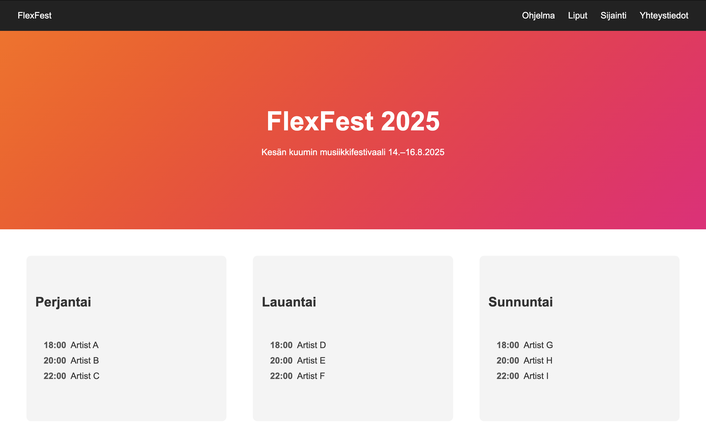
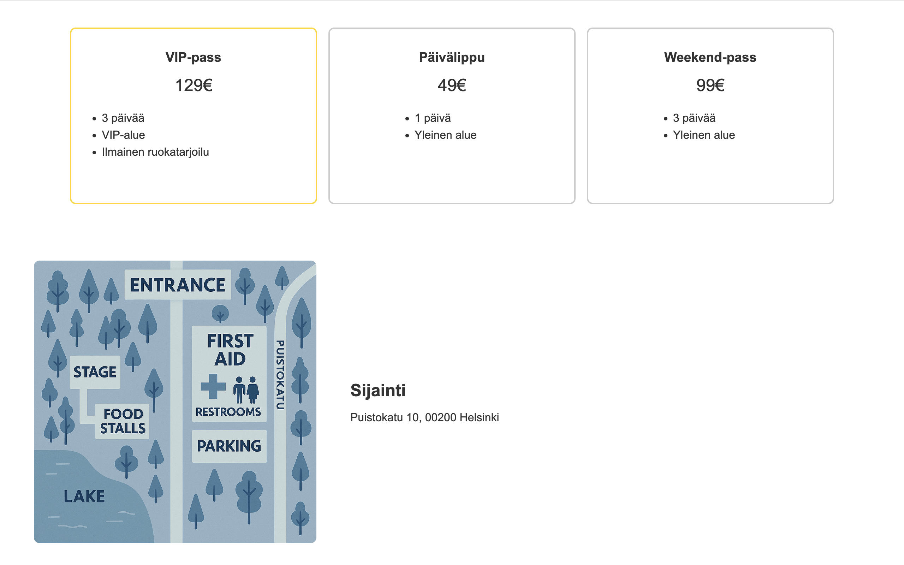
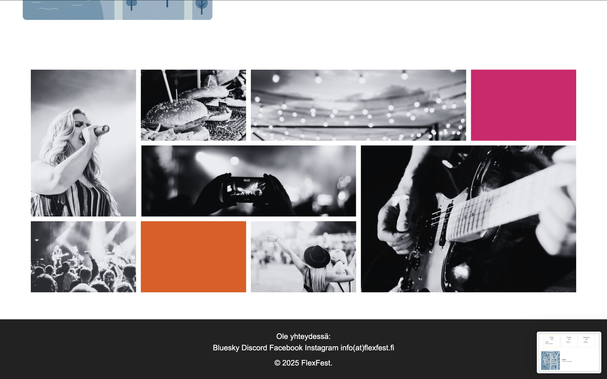

## 🎵 FlexFest 2025

FlexFest 2025 is a responsive festival website built with HTML and CSS.
It presents a fictional summer music festival happening on 14.–16.8.2025 in Helsinki.
-----
The project focuses on layout structure, Flexbox/Grid usage, and clean section-based design.

------
## 🌟 Features

🎤 Festival hero section

📅 3-day program calendar

🎟️ Ticket pricing cards (including VIP highlight)

📍 Location section with festival map

🖼️ Image gallery grid

📱 Responsive navigation and layout

🔗 Footer with social/contact links
----
## 🛠️ Technologies Used

- HTML5

- CSS3

- Flexbox

- CSS Grid
----
## 📂 Project Structure

FlexFest/
│── index.html
│── style.css
│── festivaalialue.png
│── images/
│   ├── kuva1.png
│   ├── kuva2.png
│   └── ...

----

📸 Preview

The website includes:

A clean header with navigation

A hero section introducing the festival

Program cards for each day

Ticket comparison layout

Location map

Responsive image gallery

Footer with contact links

----
## 👩‍💻 Author 
Bita Yeganeh
