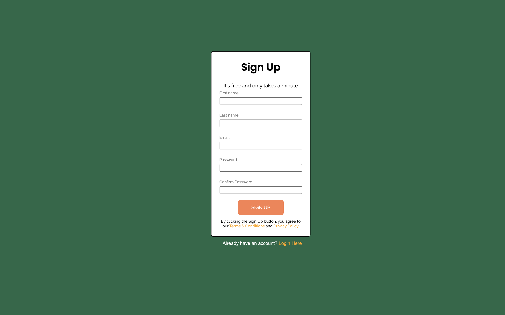

# 📝 Sign Up Form

A simple and clean **Sign Up Form** built using HTML and CSS.  
This project is designed as a beginner-friendly frontend practice to create a modern registration form layout.

---

## ✨ Features

- User-friendly sign-up form
- Fields for:
  - First Name
  - Last Name
  - Email
  - Password
  - Confirm Password
- Styled submit button
- Terms & Conditions disclaimer section
- Login redirect message
- Google Fonts integration (Raleway & Poppins)
- Responsive viewport setup

---

## 🛠️ Built With

- HTML5
- CSS3
- Google Fonts

---

## 📂 Project Structure
📁 project-folder
│── index.html
│── style.css
│── README.md

---

## Screenshot

💙 Made for frontend practice and learning.